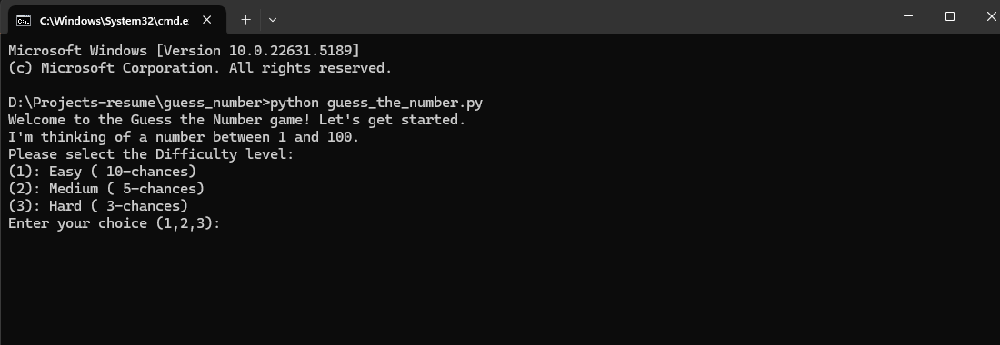
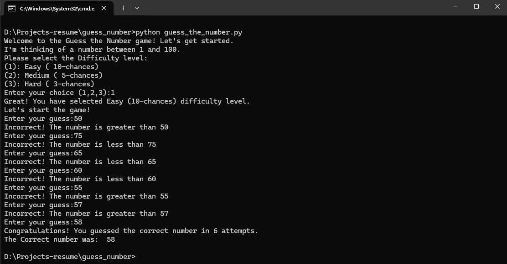
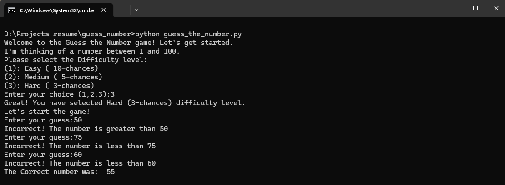

# Guess the Number Game 🎮

A simple yet engaging Python-based number guessing game where players try to guess a randomly generated number between 1 and 100.

## Features

- Three difficulty levels:
  - Easy (10 attempts) 🟢
  - Medium (5 attempts) 🟡
  - Hard (3 attempts) 🔴
- Interactive command-line interface
- Real-time feedback on each guess
- Error handling for invalid inputs

## How to Play

1. Run the game using Python:
   ```bash
   python guess_the_number.py
   ```

2. Select your difficulty level:
   - Press `1` for Easy
   - Press `2` for Medium
   - Press `3` for Hard

3. Enter your guesses when prompted
4. After each guess, you'll receive feedback telling you if the actual number is higher or lower
5. Keep guessing until you find the correct number or run out of attempts!

## Screenshots

 1. `game_start.png` - Screenshot of the game's welcome screen and difficulty selection 
 2. `win_screen.png` - Screenshot of a winning game  
 3. `lose_screen.png` - Screenshot of a lost game



## Requirements

- Python 3.x
- No additional packages required

## Game Logic

The game:
1. Generates a random number between 1 and 100
2. Asks the player to choose a difficulty level
3. Provides feedback after each guess:
   - "Greater than" if the guess is too low
   - "Less than" if the guess is too high
   - "Congratulations!" when the correct number is guessed

## Future Enhancements

Potential improvements that could be added:
- High score system
- GUI interface
- Sound effects
- Custom difficulty settings
- Multiplayer mode

## Contributing

Feel free to fork this project and submit pull requests with improvements!

## License

This project is open source and available under the MIT License.